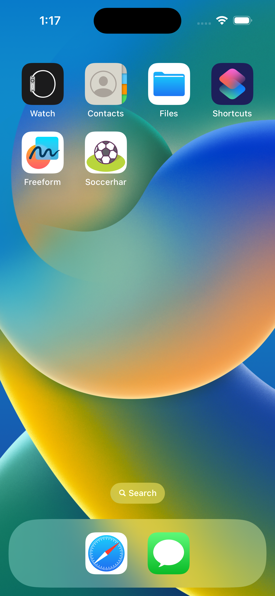
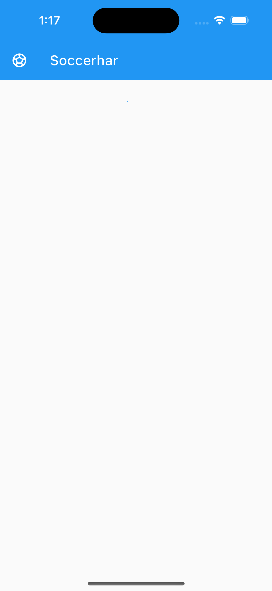
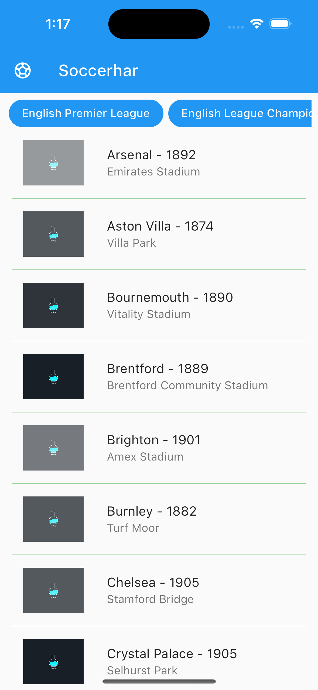
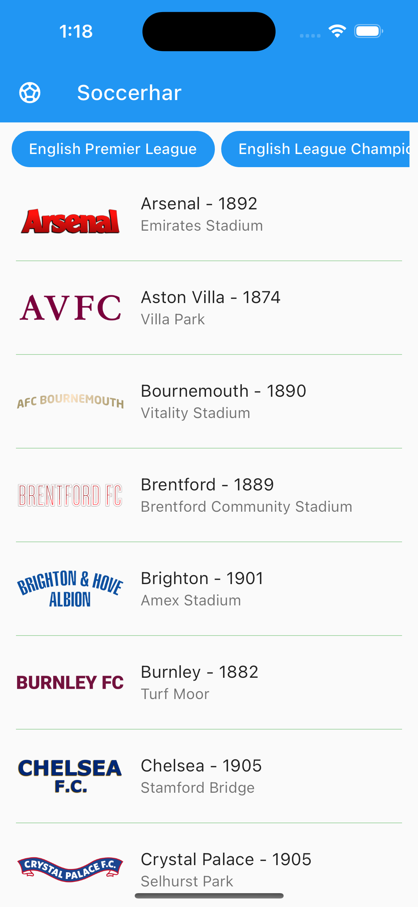
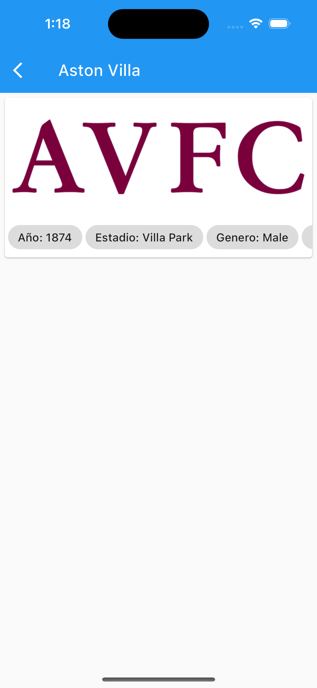
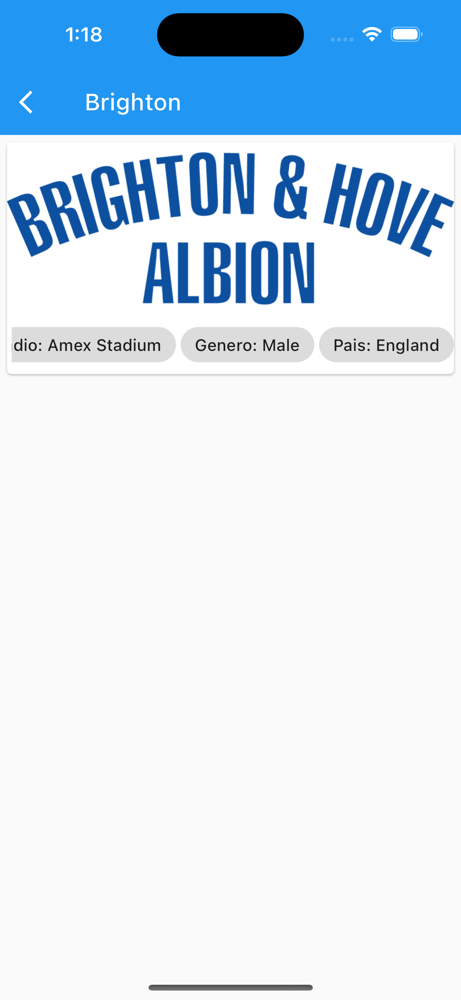

# Soccerhar

Todo lo relacionado con el deporte

## Ejecucion

1. Clonar el proyecto
2. Ejecutar el comando ```flutter pub get```

## Dependencias

El aplicativo esta basado en las siguientes dependencias

```
go_router: ^6.2.0
dio: ^5.1.2
flutter_riverpod: ^2.3.6
equatable: ^2.0.5
```
## Launch Screen
Realizado de forma nativa tanto para Android como para IOS 

## Screenshot






